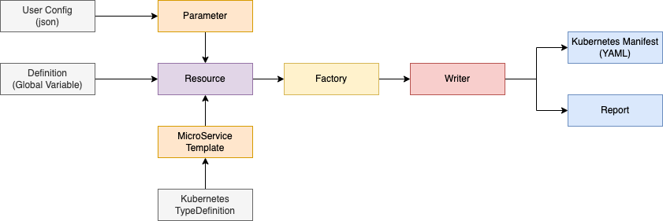

# Kubernetes Template

## Setup

```bash
# Install Package Manager
npm i pnpm@7.1.0

# Install node_modules
pnpm i
```

## Build

```bash
pnpm run build
# Generate Manifest (output: overlays/*)
# Generate Report   (output: report/*)
```

## Test

```bash
pnpm run test
```

## Manifest Generate Architecture



## Demo

1. Setup Your Kubernetes
   - Use [Docker Desktop](https://docs.docker.com/desktop/kubernetes/)
2. Istio Setup
   - https://istio.io/latest/docs/setup/getting-started/
     - `istioctl install --set profile=demo -y`
   - https://istio.io/latest/docs/setup/install/operator
     - `istioctl operator init --watchedNamespaces=demo`
3. Argo Rollouts Setup
   - https://argoproj.github.io/argo-rollouts/installation/

```bash
$ kubectl create ns demo
$ kubectl apply -k ./overlays/dev/
```

Write the following in `/etc/hosts`

```
127.0.0.1       pc.localhost.com
127.0.0.1       sp.localhost.com
```

**Access**

```bash
http://pc.localhost.com:30000
http://sp.localhost.com:30000
```

**Clean Up**

```bash
$ kubectl delete -k ./overlays/dev/
$ kubectl delete ns demo
```

## LICENSE

MIT [@Himenon](https://github.com/Himenon)
